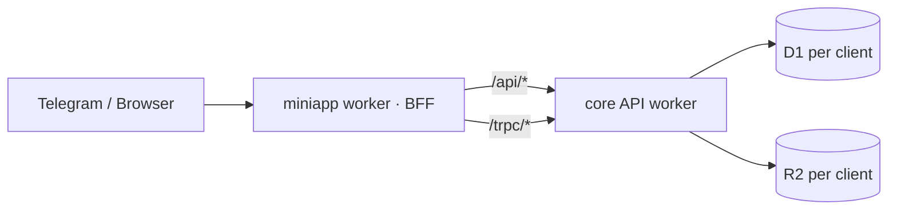

# Headless Entity Engine — Software Factory

Enterprise-grade **headless CMS / entity engine** on Cloudflare Workers (Hono + D1 + R2), built as a **software factory**: one starter template, then per-client isolated deployments via the `headless` CLI.

**Less configure, gain big power.** Define a collection once (REST API / CLI) and you instantly get a production API + admin panel: auth & RBAC, 15 filter operators, cursor pagination, full-text search, validation, relations, audit, media, exports, reports, and multi-tenant deploys — no extra configuration. See [Use Cases](docs/getting-started/use-cases.md) and the [5-minute Quickstart](docs/getting-started/quickstart.md).

|              |                                                                                                                                                            |
| ------------ | ---------------------------------------------------------------------------------------------------------------------------------------------------------- |
| Core API     | `apps/api` — Hono worker (entities, auth/RBAC, search, audit, webhooks, scheduler, reports, tRPC)                                                          |
| MiniApp      | `apps/tgapp` — **Telegram Mini App** (mobile-first Vite + Tailwind v4) + BFF worker (proxies `/api/*` → core); same service binding as the old desktop SPA |
| Core engine  | `packages/core` — D1 client, QueryBuilder, entity engine, safe expression evaluator, migrations                                                            |
| Shared types | `packages/types` — TypeScript types incl. tRPC `AppRouter`                                                                                                 |
| CLI          | `packages/cli`                                                                                                                                             | scaffolding, db ops, and **software-factory client onboarding** (`headless client …`) |
| Templates    | `packages/cli/templates` — guided module/plugin/worker scaffolds (Strapi/Frappe-style) — `headless module create`                                          |

> ⚠️ Cloudflare Workers constraint: **`new Function()` / `eval` are disallowed** on the runtime. All expressions use the safe evaluator in `packages/core/src/entity/expression.ts` — extend that, never reach for `eval`.

---

## 🛡️ Platform Hardening (built-in)

> ⚙️ **Optional infrastructure defaults to OFF** — flip a var to enable: `BACKUP_ENABLED` · `ANALYTICS_ENABLED` · `RATE_LIMIT_DO`.

| Capability               | Where                                                                                                   | Notes                                                                                                                                                                                                                                                                                                                                                                                                                                                                                                                                                                                                                     |
| ------------------------ | ------------------------------------------------------------------------------------------------------- | ------------------------------------------------------------------------------------------------------------------------------------------------------------------------------------------------------------------------------------------------------------------------------------------------------------------------------------------------------------------------------------------------------------------------------------------------------------------------------------------------------------------------------------------------------------------------------------------------------------------------- |
| **Global rate limiting** | Durable Object (`GlobalRateLimitStore`, SQLite)                                                         | Per-tier per-IP fixed windows (anon 100 · user 300 · admin 1000 req/min). **Default OFF** (`RATE_LIMIT_DO=false` → in-memory limiter, free + instant). Enable per client: `RATE_LIMIT_DO=true`.                                                                                                                                                                                                                                                                                                                                                                                                                           |
| **Security headers**     | `middleware/security-headers.ts`                                                                        | HSTS, `X-Content-Type-Options`, `X-Frame-Options`, `Referrer-Policy`, `Permissions-Policy`; `no-store` on `/api/auth/*`                                                                                                                                                                                                                                                                                                                                                                                                                                                                                                   |
| **Webhook reliability**  | Cloudflare Queues (webhook + event queues per client — `QUEUE_WEBHOOK`/`QUEUE_EVENTS` in `infra/env.*`) | HMAC-SHA256 signed, exponential backoff retries, consumer in the API worker. Falls back to direct fetch without the queue binding. Only active when webhooks exist (on-demand, no default cost).                                                                                                                                                                                                                                                                                                                                                                                                                          |
| **Nightly backup**       | Cron `0 2 * * *` → R2 `backups/<date>/`                                                                 | **Default OFF** (`BACKUP_ENABLED=false` — cron no-ops). Enable: set `BACKUP_ENABLED=true`. **Two artifacts**: `<stamp>.sql` (full SQLite dump — restore via `wrangler d1 import` / `sqlite3`) + `<stamp>.json` (engine snapshot for `headless db restore`). Covers ALL tables incl. system tables + FTS5 rebuild. Auto-prunes older than `BACKUP_RETENTION_DAYS` (default 7). Complements **D1 Time Travel** (free, always-on, 30-day point-in-time restore) — Time Travel is the first line for recent accidents, R2 backup is the long-term/portability layer (`wrangler d1 time-travel restore <db> --timestamp=...`). |
| **Error archiving**      | `middleware/error-handler.ts`                                                                           | 5xx errors → R2 `errors/<date>/<request_id>.json`                                                                                                                                                                                                                                                                                                                                                                                                                                                                                                                                                                         |
| **Usage analytics**      | Workers Analytics Engine (per-client dataset — `ANALYTICS_DATASET` in `infra/env.*`)                    | **Default OFF** (`ANALYTICS_ENABLED=false` — zero datapoints, zero cost). Enable: `ANALYTICS_ENABLED=true`. Per request: client, route group, tier, status, duration.                                                                                                                                                                                                                                                                                                                                                                                                                                                     |
| **Signed media uploads** | `POST /api/media/presign` → `POST /api/media/upload/:token`                                             | 15-min HMAC one-time token, 25 MB cap, delegated uploads without the app token.                                                                                                                                                                                                                                                                                                                                                                                                                                                                                                                                           |
| **Audit masking**        | `audit.service.ts`                                                                                      | Sensitive fields (`password`, `secret`, `token`, …) redacted from audit snapshots.                                                                                                                                                                                                                                                                                                                                                                                                                                                                                                                                        |

---

## 📚 Documentation Map

**Start here:** [`docs/README.md`](docs/README.md) — the verified API documentation index.

| Area                                                                               | Path                                                                                                                                         |
| ---------------------------------------------------------------------------------- | -------------------------------------------------------------------------------------------------------------------------------------------- |
| **API docs index / entry point**                                                   | [`docs/README.md`](docs/README.md)                                                                                                           |
| 5-min quickstart (curl examples)                                                   | [`docs/getting-started/quickstart.md`](docs/getting-started/quickstart.md)                                                                   |
| Use cases — less configure, gain big power                                         | [`docs/getting-started/use-cases.md`](docs/getting-started/use-cases.md)                                                                     |
| Installation & env config                                                          | [`docs/getting-started/installation.md`](docs/getting-started/installation.md) · [`configuration.md`](docs/getting-started/configuration.md) |
| Entities (CRUD, filters, cursor pagination)                                        | [`docs/backend-api/entities.md`](docs/backend-api/entities.md)                                                                               |
| Authentication (JWT, dev-token, RBAC)                                              | [`docs/backend-api/authentication.md`](docs/backend-api/authentication.md)                                                                   |
| Users, roles & permissions                                                         | [`docs/backend-api/users-roles-permissions.md`](docs/backend-api/users-roles-permissions.md)                                                 |
| tRPC type-safe layer                                                               | [`docs/backend-api/trpc.md`](docs/backend-api/trpc.md)                                                                                       |
| Search / Audit / Export / Webhooks / Scheduler / Reports / Media / Modules / Views | [`docs/backend-api/`](docs/backend-api/)                                                                                                     |
| Concepts (entities, field types, relations, workflow)                              | [`docs/concepts/`](docs/concepts/)                                                                                                           |
| Field linkage rules (show/hide/calc)                                               | [`docs/backend-plugins/linkage-rules.md`](docs/backend-plugins/linkage-rules.md)                                                             |
| Field validation (12 rule types)                                                   | [`docs/backend-plugins/field-validation.md`](docs/backend-plugins/field-validation.md)                                                       |
| Default expressions                                                                | [`docs/backend-plugins/default-expressions.md`](docs/backend-plugins/default-expressions.md)                                                 |
| Server hooks (declarative rules)                                                   | [`docs/backend-plugins/server-functions.md`](docs/backend-plugins/server-functions.md)                                                       |
| Field encryption (AES-256-GCM)                                                     | [`docs/backend-plugins/field-encryption.md`](docs/backend-plugins/field-encryption.md)                                                       |
| Schema snapshot / diff (IaC)                                                       | [`docs/backend-plugins/schema-snapshot.md`](docs/backend-plugins/schema-snapshot.md)                                                         |
| OpenAPI, collection actions                                                        | [`docs/backend-plugins/`](docs/backend-plugins/)                                                                                             |
| Security overview                                                                  | [`docs/security/overview.md`](docs/security/overview.md)                                                                                     |
| **CLI reference** (commands, guides)                                               | [`docs/cli/README.md`](docs/cli/README.md) · [`commands.md`](docs/cli/commands.md) · [`guides.md`](docs/cli/guides.md)                       |

### Which doc should I open?

| I want to…                      | Open                                                                             |
| ------------------------------- | -------------------------------------------------------------------------------- |
| Call the API (curl / Postman)   | `docs/getting-started/quickstart.md`                                             |
| Build a collection + fields     | `docs/backend-api/entities.md` + `concepts/field-types.md`                       |
| Add auth / roles                | `docs/backend-api/authentication.md` + `users-roles-permissions.md`              |
| Use the CLI / scaffold a module | `docs/cli/README.md`                                                             |
| Onboard a new client (factory)  | `docs/cli/commands.md` → `client` section                                        |
| Deploy to Cloudflare            | Setup guide below → **Deploy**                                                   |
| Install a business module       | `headless module create` (guided) · `headless collection create --template <id>` |

---

## 🏗️ Architecture



- **Clean starter** — the core API + admin UI ship with **no business modules**; scaffold them on demand via the CLI (`headless module create` — Strapi/Frappe-style guided generation from templates in `packages/cli/templates`).
- **Per-client isolation** — every client gets its own D1, R2, secrets, and workers (see CLI below).

---

## 🚀 Setup Guide

### Prerequisites

- Node.js ≥ 20, `pnpm` 10.x
- [Wrangler](https://developers.cloudflare.com/workers/wrangler/) configured (`npx wrangler login`)
- A GitHub token with access to the `@mmbix` packages: `export NPM_TOKEN=ghp_…` (`.npmrc` reads `${NPM_TOKEN}`)

### 0. Create a new project (starter template)

Clone this repo from `main`, let the CLI prompt you for the D1 database name +
bootstrap superadmin (email, name, password), and it auto-configures everything
(worker/D1/R2/queue names, `.dev.vars`, `.env.local`):

```sh
# 1. Clone from main
mkdir my-saas && cd my-saas
git clone --depth 1 --branch main https://github.com/mmbix/cf_headless.git .

# 2. Install deps (needs NPM_TOKEN for the private @mmbix registry)
export NPM_TOKEN=ghp_…
pnpm install

# 3. Scaffold — initializes THIS folder in place (one folder = one project).
#    Prompts: DB name → admin email → name → password, then auto-configures
#    worker names, D1 database_name + placeholder ids, R2 bucket, queues,
#    analytics dataset, .dev.vars, .env.local
npx headless init .        # headless runs from this repo itself — no global install needed

# 4. Go!
pnpm dev        # API :8788 · studio :5174 · miniapp :5175
```

> Optional: `pnpm cli:link` builds + links `headless` **globally** (one-time) so you can
> type `headless …` instead of `npx headless …` in any terminal.

Non-interactive (CI): `npx headless init . --db-name my-saas-db --admin-email admin@my.co --admin-name "My Admin" --admin-password 'Strong#Pass1'`.
(Prefer a nested project instead? `npx headless init my-saas` still works.)

Before deploying a new project, create its Cloudflare resources and fill in the
ids wrangler reports back (`apps/api/wrangler.jsonc`):

```sh
npx wrangler d1 create my-saas-db          # → paste database_id / preview_database_id
npx wrangler r2 bucket create my-saas-media
npx wrangler queues create my-saas-webhook-delivery
```

Local development needs none of that — `wrangler dev` simulates D1/R2/queues.

---

### 1. Install (running this repo directly)

### 2. Local dev (all workers)

```sh
pnpm dev
```

| Service              | URL                                 |
| -------------------- | ----------------------------------- |
| MiniApp SPA + BFF    | `http://localhost:5175`             |
| UI Studio (dev tool) | `http://localhost:5174`             |
| Core API worker      | `http://localhost:8788`             |
| tRPC (via BFF proxy) | `http://localhost:5175/trpc/health` |

**UI Studio** (`apps/studio`, port 5174) is a development-time visual tool —
it writes menu trees / layouts to the API (D1) and the mini app picks
them up live. It is not deployed; production runs compiled configs only.

**Login (local dev):** `dev@mmbics.com` / `dev-password-for-local-only`

Local secrets live in `apps/api/.dev.vars` (git-ignored). `headless init` writes
`ADMIN_USERNAME` / `ADMIN_PASSWORD` / `ADMIN_NAME` / `JWT_SECRET` there for you —
the email, display name and password you choose at init time become the
bootstrap superadmin (Administrator role). If ports are stuck: `pnpm dev:clean`.

### 3. Tests & typecheck

```sh
pnpm test                    # turbo — core + api suites
pnpm typecheck               # all packages
pnpm --filter @mmbix/tgapp build     # miniapp bundle
```

### 4. Deploy to Cloudflare

> The worker configs (`apps/api/wrangler.jsonc`, `apps/tgapp/wrangler.jsonc`, and
> the test-only `apps/api/wrangler.testco.jsonc`) are **generated** from the infra
> SSOT — edit `infra/env.prod` / `infra/env.testco` and run `pnpm gen:infra`
> instead of touching them by hand (`pnpm check:infra` is the CI drift gate).
> Resource map + rename runbook: `infra/README.md`. Secrets are set with
> `wrangler secret put`, never in vars.

One command deploys **both** workers — backend API + frontend Mini App (names come from `WORKER_API`/`WORKER_MINIAPP` in `infra/env.prod` — today `mff-sys-api` + `mff-sys-miniapp`):

```sh
pnpm run deploy            # build + deploy BOTH workers
```

Or deploy them separately:

```sh
pnpm run deploy:api        # backend only — core API worker (WORKER_API in infra/env.prod)
pnpm run deploy:tgapp      # frontend only — Mini App worker + SPA assets (WORKER_MINIAPP)
```

`pnpm run deploy` builds the workspace packages first (turbo's `deploy` task
`dependsOn` `build`), then deploys each worker with `wrangler deploy` from its
own `apps/*/wrangler.jsonc`. Tests are **not** part of the deploy pipeline —
run `pnpm test` separately for the full test gate.

Or via the CLI (respects `CLOUDFLARE_ACCOUNT_ID`):

```sh
headless deploy                 # deploy all
headless deploy --target api    # one target
```

> **Secrets** (never in `wrangler.jsonc`): `npx wrangler secret put ADMIN_PASSWORD` · `npx wrangler secret put JWT_SECRET`

---

## 🏢 Software Factory — Onboarding a Client

Every client gets an **isolated** stack with a consistent naming convention — one command does it all:

```sh
headless client add --company "Acme Corp" -y        # register the client
headless client list                                # view clients
headless client status acme                         # naming map
headless client deploy acme                         # provision + deploy (api → frontend)
```

`client deploy` automatically:

1. **Creates** the client's D1 database + R2 bucket (if missing) and binds workers to **their own** D1 — multi-tenant isolation.
2. **Generates** per-client `wrangler.<prefix>.jsonc` (wrangler has no `${VAR}` interpolation) and deploys with `--config`.
3. **Provisions** a strong `ADMIN_PASSWORD` + `JWT_SECRET` via `wrangler secret put`, saved to `clients/<prefix>/.env` (git-ignored).

**Naming convention** (tenant key = prefix): `{prefix}-cms` · `{prefix}-frontend` · `{prefix}-cms-db` · `{prefix}-cms-media` · tables `{prefix}_*`

> 🔑 Client login = `dev@mmbics.com` with the **generated** password in `clients/<prefix>/.env` — never reuse the factory dev password.

Full reference: [`docs/cli/commands.md`](docs/cli/commands.md)

---

## 🔑 Credentials & Secrets Cheat-Sheet

| Context                   | Email            | Password                                                |
| ------------------------- | ---------------- | ------------------------------------------------------- |
| Local dev (`IS_DEV=true`) | `dev@mmbics.com` | `dev-password-for-local-only` (in `apps/api/.dev.vars`) |
| Cloudflare factory        | `dev@mmbics.com` | `dev-password-for-local-only` (secret)                  |
| CLI-provisioned client    | `dev@mmbics.com` | generated → `clients/<prefix>/.env`                     |

Secrets are **never** committed: `.dev.vars`, `.env.local`, `clients/**/.env`, and `wrangler.*.jsonc` are git-ignored.
