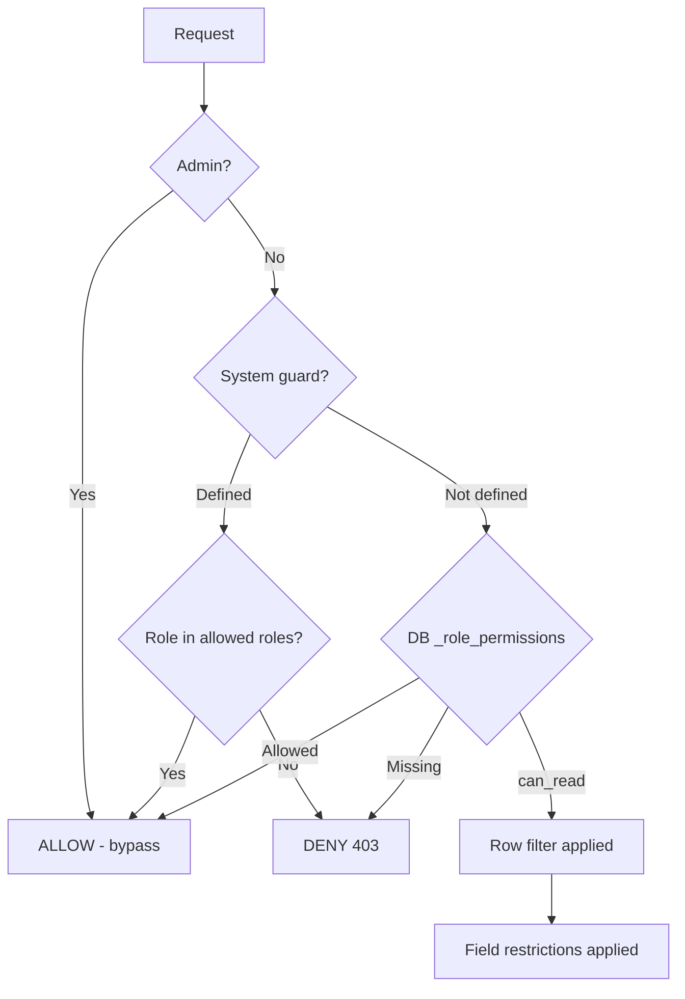

# Users, Roles & Permissions

User management and the hybrid RBAC system (file-based system guards + DB-based business permissions).

## Endpoints

| Method | Path                              | Permission | Description          |
| ------ | --------------------------------- | ---------- | -------------------- |
| GET    | `/api/users`                      | admin      | List users           |
| POST   | `/api/users`                      | admin      | Create user          |
| GET    | `/api/users/:id`                  | admin      | Get user             |
| PUT    | `/api/users/:id`                  | admin      | Update user          |
| GET    | `/api/users/roles`                | admin      | List roles           |
| POST   | `/api/users/roles`                | admin      | Create role          |
| POST   | `/api/users/permissions`          | admin      | Set permissions      |
| GET    | `/api/users/permissions/:role_id` | admin      | Get role permissions |

## Users

### Create User

`POST /api/users`

```bash
curl -X POST http://localhost:8788/api/users \
  -H 'Authorization: Bearer dev-token' -H 'Content-Type: application/json' \
  -d '{"email": "editor@example.com", "password": "secret123", "full_name": "Editor One", "role_id": "<role-id>"}'
```

**Validation:** valid email, password >= 6 chars, `full_name` required. An
`employee_id` (see below) must name a LIVE `hrm_employees` row — a link to a
missing or deactivated employee is refused with `400`, because the resulting
account could never sign in.

**Response `201`:**

```json
{
	"success": true,
	"data": { "id": "...", "email": "editor@example.com", "full_name": "Editor One" }
}
```

### Update User

`PUT /api/users/:id` — fields: `email`, `password`, `full_name`, `role_id`, `employee_id`, `status` (`active`/`disabled`).

**`status: "disabled"` is a real revocation.** The account is refused at
`POST /api/auth/login` (no token is minted) and any token already issued is
rejected on its next request — and the failure is reported as
`401 Invalid email or password`, identical to a wrong password, so it cannot be
used to enumerate accounts. Re-enabling takes effect just as immediately.
See `authentication.md`.

> ⚠️ **Each field is applied only when truthy**, and a role is therefore never
> un-assigned: `PUT` with `role_id: null` leaves the stored role untouched. An
> account always keeps a role once it has one — to move it, send a real role id.
>
> `employee_id` is the deliberate EXCEPTION — it is nullable AND un-settable,
> because "this account acts as nobody" is a legitimate state (the bootstrap
> admin is one) and un-linking is the fix for a binding made to the wrong person:
> `null` (or `""`) clears the link, `undefined`/omitted leaves it alone.

### The employee link (`_users.employee_id`)

The ONE thing connecting a login identity to the person it acts as. A Telegram
account needs no column — its `tg-<id>@telegram.local` email IS the link (the
login route resolves the directory row whose `etg_id` matches). A **password**
account has no such marker, so `_users.employee_id` (added by migration
`035_users_employee_id`, nullable, indexed) supplies one, and it is what makes a
web sign-in usable:

- **Sign-in binds the employee.** `AuthService.login` mints the token with that
  employee id, exactly as the Telegram route does — without it every
  server-scoped action (punch, leave, custody, transfers) refused a web session.
- **Offboarding revokes it.** `verifyToken` → `_healActingEmployee` re-validates
  the link on EVERY request (one indexed point read, uncached), so a token stops
  working the moment the employee is soft-deleted or set `active: false` — the
  property the Telegram `etg_id` gate always had and the web path did not.
- **Exactly one identity source per row.** Telegram (`tg-<id>` email) XOR employee
  link XOR neither (the bootstrap admin). The two never both apply.
- **An account with no link still signs in** — it simply has no acting employee,
  which is the right shape for an admin/HR login. It may embed an employee id for
  other reasons (a machine key, a row-scope probe); those are left untouched.

## The Users table (Studio Admin + IDP portal)

The `_users` registry is the ONE admin table for accounts, mounted as **Users**
under _Studio Admin → Settings_ and as **Users** in the _IDP portal_ — the same
component (`apps/studio/src/components/admin/users-tab.tsx`) on both surfaces, so
they cannot drift. It writes through the endpoints above; there is no second
path.

`_users` holds every principal in one table — the bootstrap admin, password
accounts, and the identities the Telegram login route provisions — and carries no
`kind`/`provider` column. The table therefore DERIVES what a row is
(`identityKindOf` in `apps/studio/src/lib/users.ts`) and shows:

| Column       | Meaning                                                                  |
| ------------ | ------------------------------------------------------------------------ |
| Account      | `full_name`, with the email beneath it                                   |
| Signs in via | `Password` (an email + password account) or `Telegram` (directory-gated) |
| Employee     | The `hrm_employees` row the account acts as, or `Not linked`             |
| Role         | The `_roles` name for the row's `role_id`                                |
| Status       | `active` / `disabled` — the sign-in switch, see above                    |
| Last sign-in | `Never` when the account has not signed in yet                           |
| Created      | `created_at`                                                             |

Guarantees the UI holds to:

- **No credential is ever displayed.** The API strips `password_hash`
  (`AuthService.SAFE_USER_FIELDS`) and the table has no column for it; setting a
  password is a write-only action ("set a new one", never "reveal the old").
- **The Employee column answers "which employee?" for EVERY account kind** —
  a password account through its `employee_id`, a Telegram account through the
  directory row its `tg-<id>` address matches (`telegramIdOf` + `etg_id`), and
  `Not linked` when neither resolves, so an account that cannot act as anyone is
  visible rather than looking empty. Searching matches whatever the column shows,
  and the employee picker lists the roster — including employees with no account
  yet.
- **An edit sends only the fields that changed.** Re-sending identical values would
  touch `updated_at`, which every cached authz lookup keys off, evicting permission
  caches for a no-op.
- **A Telegram row offers no password field and no writable name or role.** Those
  are re-synced from the employee directory on every sign-in
  (`findOrCreateUser`), so a control there would silently not stick; the status
  switch — which DOES stick — remains. It offers no employee control either: its
  employee is whatever its address names, and a second editable link would give
  one fact two sources of truth.
- **An operator cannot disable their own account.** That would revoke the session
  they are using, and recovery is another admin, not this screen.
- **A deployment with no `hrm_employees` collection still works** (the factory
  core, `DOMAIN_MODULES=none`): the employee read degrades, the picker is
  disabled, and the table says so — accounts stay administrable.

## Roles

### List Roles

`GET /api/users/roles` — includes `Administrator` and `System` (immutable).

### Create Role

`POST /api/users/roles`

```bash
curl -X POST http://localhost:8788/api/users/roles \
  -H 'Authorization: Bearer dev-token' -H 'Content-Type: application/json' \
  -d '{"name": "Editor", "description": "Can edit content"}'
```

**Immutability:** `Administrator` and `System` roles cannot be deleted or renamed.

## Permissions

### Set Permissions

`POST /api/users/permissions`

```bash
curl -X POST http://localhost:8788/api/users/permissions \
  -H 'Authorization: Bearer dev-token' -H 'Content-Type: application/json' \
  -d '{
    "role_id": "<role-id>",
    "collection_slug": "products",
    "can_read": true,
    "can_write": true,
    "can_create": true,
    "can_delete": false,
    "can_approve": false,
    "can_submit": true,
    "field_restrictions": ["id", "title", "price"],
    "row_filters": {"type": "all"}
  }'
```

| Field                                                  | Description                                                   |
| ------------------------------------------------------ | ------------------------------------------------------------- |
| `can_read` / `can_write` / `can_create` / `can_delete` | CRUD permissions                                              |
| `can_submit`                                           | Can set status to `submitted`                                 |
| `can_approve`                                          | Can set status to `approved`                                  |
| `field_restrictions`                                   | Array of allowed field names (whitelist); `"*"` or null = all |
| `row_filters`                                          | JSON: `{"type": "all"}` or conditions (below)                 |

### Row Filters

Restrict which records a role can see:

```json
{
	"type": "and",
	"conditions": [
		{ "field": "department", "op": "eq", "value": "sales" },
		{ "field": "owner", "op": "eq", "value": "$CURRENT_USER" }
	]
}
```

Supported operators: `eq`, `neq`, `gt`, `gte`, `lt`, `lte`, `in`, `nin`, `null`, `nnull`, `like`.

Dynamic variables (resolved by `DataFilterService._resolveVariable`):

- `$CURRENT_USER` → `auth.user_id`
- `$CURRENT_USER.<field>` → any field on `AuthContext`, which is exactly
  `user_id`, `role_id`, `role_name`, `email`, `is_admin`.

> ⚠️ **An unsupported path fails silently, not loudly.** `$CURRENT_USER.telegram_id`
> (or any field not on `AuthContext`) is left as the literal string, so the SQL
> becomes `col = '$CURRENT_USER.telegram_id'` — matching nothing. The role then
> sees an empty list rather than an error. Check the resolved filter if a role
> suddenly sees zero rows. The Telegram id is not on `AuthContext`; it is only
> recoverable from `email` (`tg-<id>@telegram.local`), so a row filter keyed on
> `employee_tg_id` needs `AuthContext` extended first.

> 🔒 **Row filters gate WRITES and DECISIONS, not just reads.** Every update /
> delete / restore runs `checkRowFilterAccess` first, and both the workflow engine
> (`/api/entities/:c/:id/approve|reject`, `/api/workflows/:id/transition`) and the
> approvals plugin run with the CALLER's auth — so a role can never drive a
> document its row filter hides. A workflow guard still evaluates the FULL row:
> the engine reads unauthenticated and applies only the ROW filter explicitly, so
> a role's field restrictions never change what a guard sees.

> ⚠️ **Row filters are opt-in, and `null` means SEE EVERYTHING.** A role with
> `can_read` on a collection and no `row_filters` reads every row in it — there is
> no implicit scoping to "own records". Verify with
> `GET /api/users/permissions/:role_id` before assuming a read is restricted.

### Field Restrictions

A whitelist of visible fields. Hidden fields are stripped from responses. `id`, `created_at`, `updated_at` are always included.

The same whitelist gates **writes**: a create/update that names a field outside it is rejected `403` (naming the fields), and the write response is redacted exactly like a read. Setting a column a role may `can_write` but cannot _read_ would be privilege escalation — the write side is denied by default, so it is never silently dropped. Fields the engine itself binds (the collection's `policies.actor_fields` / `writes.frozen_fields`) are exempt: the service owns those, not the caller.

## How RBAC Works



- **System guards** (file-based): admin-only operations — user management, roles, permissions, webhooks, scheduler, reports, system settings
- **Business permissions** (DB-based): collection-level CRUD, cached with 60s TTL
- Admins bypass everything

## Permission Cache

- Business permission results cached for 60 seconds
- Cache invalidated on permission/role changes (`POST /api/users/permissions`, `POST /api/users/roles`)
- Cache also invalidated when collection schema changes

## Errors

| Status | When                                             |
| ------ | ------------------------------------------------ |
| 400    | Validation failure / missing fields              |
| 401    | Not authenticated                                |
| 403    | Non-admin accessing admin routes / no permission |
| 409    | Duplicate email or role name                     |
