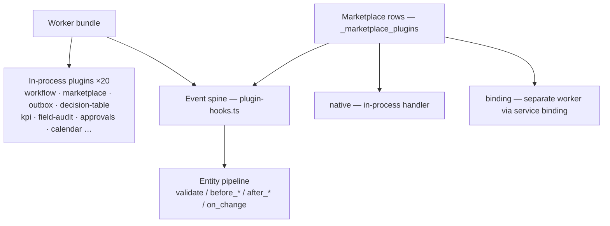

# Plugins — Development Guide & Use Cases

> Every feature in this engine is a **plugin**. There are two plugin kinds:
> **in-process plugins** (compiled TypeScript, shipped inside the worker bundle)
> and **marketplace plugins** (database rows, hot-reloadable via REST). Both
> plug into the same **event spine** (`plugin-hooks.ts`). Writing an app =
> wiring declarative data + (only when you must) a small compiled plugin.

---

## The two plugin kinds — decide first

|                | **In-process plugin**                                   | **Marketplace plugin**                                     |
| -------------- | ------------------------------------------------------- | ---------------------------------------------------------- |
| Where it lives | `apps/api/src/plugins/<id>/` — compiled into the worker | `_marketplace_plugins` table — installed via REST          |
| Interface      | `Plugin` (see below)                                    | `MarketplaceManifest` (hooks + execution mode)             |
| Code           | Any trusted TypeScript                                  | `native` handler (compiled) or `binding` (separate worker) |
| Reload         | Requires a deploy                                       | **Hot** — install/enable/disable via REST, no deploy       |
| Cost           | Always in the bundle (~1–5 KB each)                     | 0 KB if not installed                                      |
| Trust          | Trusted (you ship it)                                   | Trusted (you register it)                                  |
| Use when       | New route, new service, new table, deep integration     | Business interceptors you want to toggle without deploys   |



---

## 1. In-process plugins (`Plugin` interface)

```ts
// packages/types/src/plugin.ts (the contract)
export interface Plugin {
	id: string; // unique, e.g. "workflow"
	name: string; // human-readable
	version: string;
	migrations?: PluginMigration[]; // D1 migrations, run once per isolate
	register(ctx: PluginContext): PluginRegistration;
}

export interface PluginMigration {
	name: string;
	up: SqlStatement[];
}
export interface PluginContext {
	app: Hono; // the global app (register middleware)
	env: Record<string, unknown>; // Cloudflare bindings
	d1: D1Database;
	r2?: R2Bucket;
	config: { isDev: boolean };
	hooks: PluginHookAPI; // lifecycle hook registration
}
export interface PluginRegistration {
	routes?: Array<{ path: string; handler: Hono }>;
	middleware?: Array<{ path: string; handler: MiddlewareHandler }>;
}
```

### The lifecycle (what `index.ts` does at boot)

1. Every plugin factory runs — `const plugins = [childTablePlugin(), …, fieldAuditPlugin()]`
2. `PluginMigrationService` collects all `migrations` → runs pending ones once per
   isolate **before** core routes mount (plugin tables exist before the entity
   pipeline touches them)
3. `plugin.register(ctx)` is called with a `hooks` API scoped to the plugin id
4. Returned `routes` are mounted (`app.route(path, handler)`)

### A minimal plugin (walkthrough)

```ts
// apps/api/src/plugins/hello/plugin.ts
import type { Plugin, PluginRegistration, PluginContext } from '@mmbix/types/worker';
import { Hono, type Context } from 'hono';
import { D1Client } from '@mmbix/core';
import { requireAuth } from '@/routes/auth';
import { requireAdmin } from '@/middleware/rbac-guard';
import type { AuthContext } from '@/lib/services/auth.service';

export function helloPlugin(): Plugin {
	return {
		id: 'hello',
		name: 'Hello Greeter',
		version: '1.0.0',
		migrations: [
			{
				// ① table (single-line DDL — db.exec splits by newlines!)
				name: '026_hello',
				up: [
					{
						sql: `CREATE TABLE IF NOT EXISTS _greetings (id TEXT PRIMARY KEY, message TEXT NOT NULL, created_at TEXT NOT NULL)`,
						bindings: [],
					},
				],
			},
		],
		register(_ctx: PluginContext): PluginRegistration {
			const app = new Hono<{ Bindings: { DB: D1Database }; Variables: { auth: AuthContext } }>();
			app.use('*', requireAuth); // ② auth (admin-only writes below)

			app.get('/', async (c) => {
				// ③ routes
				const db = new D1Client((c.env as { DB: D1Database }).DB as D1Database);
				const rows = await db.all({ sql: 'SELECT * FROM _greetings ORDER BY created_at DESC', bindings: [] });
				return c.json({ success: true, data: rows });
			});
			app.post('/', requireAdmin, async (c) => {
				const db = new D1Client((c.env as { DB: D1Database }).DB as D1Database);
				const body = (await c.req.json()) as { message?: string };
				await db.run({
					sql: 'INSERT INTO _greetings (id, message, created_at) VALUES (?, ?, ?)',
					bindings: [crypto.randomUUID(), body.message ?? 'hi', new Date().toISOString()],
				});
				return c.json({ success: true, data: { created: true } }, 201);
			});

			return { routes: [{ path: '/api/hello', handler: app as unknown as Hono }] };
		},
	};
}
```

Then register it: add `helloPlugin()` to the `plugins` array in `apps/api/src/index.ts`.
Migrations are idempotent (`CREATE TABLE IF NOT EXISTS`) — new deployments apply
them automatically, old ones skip.

> **Scaffold it instead:** `npx headless create` → pick **Plugin** (also: Hook,
> Worker, Collection). Templates live in `packages/cli/templates/plugin/`
> (`manifest.ts`, `plugin.ts`, `service.ts`).

### Hooking into the entity lifecycle (`ctx.hooks`)

```ts
register(ctx) {
  ctx.hooks.on('invoices', 'before_insert', async (doc, db, auth) => {
    if (typeof doc.total !== 'number') return { abort: true, error: 'total must be a number', field: 'total' };
    return { ...doc, tax: Math.round(doc.total * 0.1) }; // transform — persisted
  });
  ctx.hooks.on({ collection: 'invoices', event: 'after_update', handler: notify, priority: 40, timeoutMs: 3000 });
}
```

### The event catalog

| Event                                         | Phase                    | Return semantics                                                                                                       |
| --------------------------------------------- | ------------------------ | ---------------------------------------------------------------------------------------------------------------------- |
| `validate`                                    | Pre-write                | `{ abort, error }` rejects the write                                                                                   |
| `before_insert` / `before_update`             | Pre-write, **transform** | a returned doc is threaded through the chain → persisted                                                               |
| `after_insert` / `after_update` / `on_change` | Post-write               | fire-and-forget (errors logged, never fatal)                                                                           |
| `before_delete`                               | Pre-delete               | `{ abort }` blocks the delete                                                                                          |
| `after_delete` / `after_restore`              | Post-delete / restore    | fire-and-forget — the row already left / re-entered the live set, so a hook keeps DERIVED state in sync (never aborts) |
| `workflow_transition`                         | Pre-commit (workflow)    | `{ abort }` blocks the transition                                                                                      |
| `workflow_transition_after`                   | Post-commit (workflow)   | fire-and-forget                                                                                                        |

Guards: reentrancy depth ≤ 3, ≤ 20 hooks per event, per-hook timeout (default 5 s).

The canonical list lives in `LIFECYCLE_EVENTS` (`@mmbix/types`, `hooks.ts`). Only the
pre-write subset is offerable to **declarative** server-function rules — see
`DECLARATIVE_TRIGGER_EVENTS` and [Server Functions](./server-functions.md#trigger-events).

---

## 2. Marketplace plugins (DB-driven, hot-reloadable)

Installed via REST into `_marketplace_plugins`; the **chain** resolves active
plugins per `(collection, event)` and threads the document through them.

### Manifest

| Field              | Meaning                                                                        |
| ------------------ | ------------------------------------------------------------------------------ |
| `hooks`            | Events wanted: `["invoices.before_insert"]` or `["*"]`                         |
| `execution_mode`   | `native` (in-process handler) or `binding` (service-bound worker)              |
| `binding_name`     | `env.<NAME>` when `binding`                                                    |
| `on_error`         | `skip` (default — broken plugin never blocks a write) or `abort` (fail-closed) |
| `fetch_timeout_ms` | Binding call budget (default 5000) — real `AbortController` cancellation       |

### Use cases per execution mode

| Mode      | Use cases                                                                                                                  |
| --------- | -------------------------------------------------------------------------------------------------------------------------- |
| `native`  | Tax/price enrichment, slug/code generation, audit log writers, validation gates, data normalization                        |
| `binding` | Heavy compute (ML/scoring), third-party calls, domain workers that need their own CPU budget / isolation, polyglot workers |

Full guide: [Declarative Workflows + Marketplace](./workflows-marketplace.md)
with a step-by-step scenario in [Workflows + Interceptors — Examples](./workflow-examples.md).

---

## 3. Compiled hooks — priority & timeout (`ctx.hooks.on`)

In-process plugins register compiled TypeScript handlers on the same spine the
entity pipeline dispatches (see [§1](#1-in-process-plugins-plugin-interface)).
The options form sets the dispatch order and a per-handler timeout:

```ts
register(ctx) {
  ctx.hooks.on({
    collection: 'invoices',
    event: 'before_insert',
    priority: 40,
    timeoutMs: 3000,
    handler: async (doc, db, auth) => ({ ...doc, slug: slugify(String(doc.title)) }),
  });
}
```

Handlers may return `void` (in-place mutation), `{ abort, error }` (reject), or a
new document (transform) — the returned doc is what gets persisted. Registration
is compile-time; no database row is needed. Introspect every registered hook at
`GET /api/hook-registry` (admin).

---

## 4. Decision guide — which tool, when?

| I want to…                                          | Tool                                                                         |
| --------------------------------------------------- | ---------------------------------------------------------------------------- |
| Enforce a state process (approval, dispatch)        | [Declarative workflow](./workflows-marketplace.md)                           |
| Compute a field from other fields                   | Linkage `calculate` / formula field / [decision table](./decision-tables.md) |
| Set defaults                                        | Default expressions / decision table `set`                                   |
| Validate input declaratively                        | Field validation (12 rules) / server functions / decision table `abort`      |
| Toggle business logic without deploys               | **Marketplace plugin** (DB row)                                              |
| Need real TS power (I/O, third-party, custom route) | **In-process plugin**                                                        |
| Fire a durable side-effect on transition            | Workflow `on_transition.trigger_plugins` → [outbox](./idempotency-outbox.md) |
| Measure the business                                | [KPI registry + materialization](./kpi-materialization.md)                   |
| Trace who set a value                               | [Data lineage](./data-lineage.md)                                            |
| Compute numbers in any rule                         | 150 functions from `@mmbix/compute` — no plugin needed                       |

**Golden rule:** reach for **data first** (workflow → decision table → server
function → marketplace row). Write a compiled plugin only when the task needs
real code (I/O, new route, new table, deep integration).

---

## 5. Installed plugins (in-process, `apps/api/src/index.ts`)

| Plugin              | What it adds                             |
| ------------------- | ---------------------------------------- |
| `child-tables`      | Table (child) fields — parent/child CRUD |
| `approvals`         | Multi-level approval states + gates      |
| `tenants`           | Tenant isolation                         |
| `openapi`           | Auto-generated Scalar API Reference      |
| `notifications`     | Notification records                     |
| `sdk`               | SDK metadata                             |
| `templates`         | Document templates                       |
| `pdf`               | PDF generation                           |
| `calendar`          | Calendar triggers                        |
| `scheduled-reports` | Scheduled report jobs                    |
| `archive`           | Archive/restore flows                    |
| `bulk-notify`       | Bulk notifications                       |
| `snapshot`          | Schema snapshots (IaC)                   |
| `server-functions`  | Declarative lifecycle rules (JSON)       |
| `workflow`          | Declarative state machines               |
| `marketplace`       | DB-driven interceptors (native/binding)  |
| `outbox`            | Durable side-effects + dead-letter queue |
| `decision-table`    | Drools-style business rules              |
| `kpi`               | Metric registry + materialization        |
| `field-audit`       | Per-field data lineage                   |

## 6. Testing a plugin

API specs run with `cloudflare:test` (vitest + miniflare pool). Convention:
**one `it` per file for plugin-table flows** (per-test D1 + once-per-isolate
migration). See `apps/api/test/decision-table.spec.ts`, `kpi.spec.ts`,
`outbox.spec.ts`, `field-audit.spec.ts`, `hook-safety.spec.ts` as templates.

```bash
cd apps/api && npx tsc --noEmit && npx vitest run test/<your-plugin>.spec.ts
```

---

## Files

| File                                | Responsibility                                                 |
| ----------------------------------- | -------------------------------------------------------------- |
| `packages/types/src/plugin.ts`      | The `Plugin` / `PluginContext` / `PluginRegistration` contract |
| `apps/api/src/index.ts`             | Plugin registry (boot order: migrations → register → routes)   |
| `apps/api/src/core/plugin-hooks.ts` | Event spine — dispatch, priority, timeout, depth guard         |
| `packages/cli/templates/plugin/`    | Scaffold templates (`headless create` → Plugin)                |
