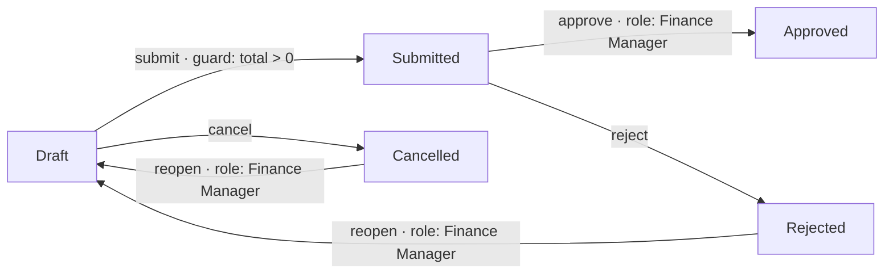

# Workflows + Interceptors — Example-Driven Guide

A complete, copy-paste walkthrough using a **Purchase Order (PO) approval**
scenario. Every command is real — run them against a local dev server
(`cd apps/api && npx wrangler dev`, then `Authorization: Bearer dev-token`).

```
Reference: [workflows-marketplace.md](workflows-marketplace.md) (API surface)
Smoke:     scripts/smoke.sh (13 automated checks — run `bash apps/api/scripts/smoke.sh`)
```

---

## The scenario

A finance team wants POs to travel through a controlled lifecycle:



With the state **mirrored onto the document** (`wf_state`) so it shows up in
every list, and mapped to the built-in `doc_status` where the built-in machine
permits it.

---

## 1. Create the collection

```bash
curl -X POST http://localhost:8788/api/entities \
  -H 'Authorization: Bearer dev-token' -H 'Content-Type: application/json' \
  -d '{
    "name": "Purchase Orders",
    "slug": "purchase_orders",
    "fields": [
      { "name": "vendor", "type": "text" },
      { "name": "total",  "type": "integer" },
      { "name": "wf_state", "type": "text", "required": false }
    ]
  }'
```

> `wf_state` is a normal optional text field — the workflow engine just writes
> to it. No magic, no hidden columns.

---

## 2. Install the workflow (JSON data — no code)

```bash
curl -X POST http://localhost:8788/api/workflows \
  -H 'Authorization: Bearer dev-token' -H 'Content-Type: application/json' \
  -d '{
    "name": "PO Approval",
    "collection": "purchase_orders",
    "initial": "draft",
    "state_field": "wf_state",
    "states": ["draft", "submitted", "approved", "rejected", "cancelled"],
    "transitions": [
      { "id": "submit", "from": "draft",     "to": "submitted",
        "guard": "doc.total > 0" },
      { "id": "approve", "from": "submitted", "to": "approved",
        "roles": ["Finance Manager"],
        "on_transition": { "trigger_plugins": ["po-audit-log"] } },
      { "id": "reject", "from": "submitted", "to": "rejected",
        "roles": ["Finance Manager"] },
      { "id": "cancel", "from": "draft",     "to": "cancelled" },
      { "id": "reopen", "from": "rejected",  "to": "draft",
        "roles": ["Finance Manager"] },
      { "id": "reopen2", "from": "cancelled", "to": "draft",
        "roles": ["Finance Manager"] }
    ],
    "doc_status_map": {
      "submitted": "submitted",
      "approved": "approved",
      "cancelled": "cancelled"
    }
  }'
```

Response contains the workflow `id` (a UUID) — save it as `$WF`:

```json
{ "success": true, "data": { "id": "f3c2…", "version": 1, "definition": { … } } }
```

**What each piece does:**

| Piece                           | Meaning                                                                                                                                                                                                                                                                                                                                                                                       |
| ------------------------------- | --------------------------------------------------------------------------------------------------------------------------------------------------------------------------------------------------------------------------------------------------------------------------------------------------------------------------------------------------------------------------------------------- |
| `guard`                         | Safe expression evaluated against `{ doc, user, from, to }` — no eval. Strings compare with quotes: `doc.vendor != 'none'`. **Financial/statistical/date functions are built in** (`@mmbix/compute`, registered into the evaluator): `NPV(0.08, doc.cashflows) > 0` · `Math.abs(PMT(0.015, 12, doc.loan)) < doc.payment` · `MEAN(doc.scores) > 60` · `DAYS_BETWEEN(doc.start, doc.end) <= 30` |
| `roles`                         | Role names allowed to perform the move (admin always allowed)                                                                                                                                                                                                                                                                                                                                 |
| `on_transition.trigger_plugins` | Marketplace plugins fired **after** the move commits                                                                                                                                                                                                                                                                                                                                          |
| `state_field`                   | Mirror the state onto `wf_state` (CRUD-visible, filterable)                                                                                                                                                                                                                                                                                                                                   |
| `doc_status_map`                | Also sync `doc_status` when the built-in machine allows                                                                                                                                                                                                                                                                                                                                       |
| `initial`                       | State assumed for a document that has never transitioned                                                                                                                                                                                                                                                                                                                                      |

> A bad definition (unknown state, unparseable guard, duplicate transition id)
> is rejected **at install time** with 400 — it can never run broken.

### Built-in compute functions (`@mmbix/compute` — single source of truth)

Every guard can call **any of the 150 pure functions** from `@mmbix/compute` —
financial (`NPV` `PMT` `IRR`…), statistical (`MEAN` `STDEV`…), timeseries
(`MOVING_AVERAGE` `PERCENT_CHANGE`…), probability (`NORMINV` `CONFIDENCE`…),
datetime, string, currency, tax, math, logic, array, pattern, conversion.

> 📖 Full reference + tree-shaking guide: [Compute Functions](../compute-core/compute-functions.md)
> · rule engine: [Expression Evaluator](../compute-core/expression-evaluator.md)

---

## 3. Roles & users

```bash
# Create the Finance Manager role
ROLE=$(curl -s -X POST http://localhost:8788/api/users/roles \
  -H 'Authorization: Bearer dev-token' -H 'Content-Type: application/json' \
  -d '{ "name": "Finance Manager" }')
# → grab the role id, then create a user in it
curl -X POST http://localhost:8788/api/users \
  -H 'Authorization: Bearer dev-token' -H 'Content-Type: application/json' \
  -d '{ "email": "finance@co.com", "password": "Finance@1!", "full_name": "Faye", "role_id": "<role-id>" }'

# Login → token
curl -X POST http://localhost:8788/api/auth/login \
  -H 'Content-Type: application/json' \
  -d '{ "email": "finance@co.com", "password": "Finance@1!" }'
# → { "data": { "token": "<USER_TOKEN>" } }
```

---

## 4. Create a document

```bash
curl -X POST http://localhost:8788/api/entities/purchase_orders \
  -H 'Authorization: Bearer dev-token' -H 'Content-Type: application/json' \
  -d '{ "vendor": "Acme Supplies", "total": 1500 }'
# → { "data": { "id": "abc-…", "wf_state": null, "doc_status": "draft", … } }
```

No state row exists yet — the engine treats the document as `initial`
(`draft`). Check it explicitly:

```bash
curl -H 'Authorization: Bearer dev-token' \
  http://localhost:8788/api/workflows/$WF/states/purchase_orders/abc-…
# → { "data": { "state": "draft", "initial": "draft" } }
```

---

## 5. The guard blocks a bad submit

```bash
# total is -5 → guard (doc.total > 0) fails
curl -X POST http://localhost:8788/api/workflows/$WF/transition \
  -H 'Authorization: Bearer dev-token' -H 'Content-Type: application/json' \
  -d '{ "document_id": "abc-…", "to_state": "submitted" }'
# → 400 { "error": "Guard on \"draft\" → \"submitted\" not satisfied" }

# Illegal jump (draft → approved is not declared)
curl -X POST http://localhost:8788/api/workflows/$WF/transition \
  -H 'Authorization: Bearer dev-token' -H 'Content-Type: application/json' \
  -d '{ "document_id": "abc-…", "to_state": "approved" }'
# → 400 { "error": "Cannot transition \"draft\" → \"approved\" (allowed: submitted, cancelled)" }
```

---

## 6. Submit, then role-gated approval

```bash
# Submit — guard passes, state advances, doc_status syncs to "submitted"
curl -X POST http://localhost:8788/api/workflows/$WF/transition \
  -H 'Authorization: Bearer dev-token' -H 'Content-Type: application/json' \
  -d '{ "document_id": "abc-…", "to_state": "submitted", "comment": "please approve" }'
# → { "data": { "from": "draft", "to": "submitted", "synced_doc_status": "submitted", … } }

# Wrong role (admin token works because admin bypasses roles — use a normal user)
curl -X POST http://localhost:8788/api/workflows/$WF/transition \
  -H "Authorization: Bearer <USER_TOKEN>" -H 'Content-Type: application/json' \
  -d '{ "document_id": "abc-…", "to_state": "approved" }'
# → 403 { "error": "Transition \"submitted\" → \"approved\" requires role: Finance Manager" }

# Finance Manager approves → approved + doc_status synced + trigger plugin fired
curl -X POST http://localhost:8788/api/workflows/$WF/transition \
  -H "Authorization: Bearer <USER_TOKEN>" -H 'Content-Type: application/json' \
  -d '{ "document_id": "abc-…", "to_state": "approved" }'
```

**After approval, the document itself shows the state** (that's `state_field`):

```bash
curl -H 'Authorization: Bearer dev-token' \
  http://localhost:8788/api/entities/purchase_orders/abc-…
# → { "data": { "wf_state": "approved", "doc_status": "approved", … } }
```

Now you can also **filter by workflow state in any list query**:

```bash
curl -H 'Authorization: Bearer dev-token' \
  'http://localhost:8788/api/entities/purchase_orders?filter[wf_state][_eq]=approved'
```

---

## 7. Audit trail

```bash
curl -H 'Authorization: Bearer dev-token' \
  http://localhost:8788/api/workflows/$WF/history/purchase_orders/abc-…
# → [
#   { "from_state": "draft", "to_state": "submitted", "by_email": "dev@…", "comment": "please approve", … },
#   { "from_state": "submitted", "to_state": "approved", "by_email": "finance@co.com", … }
# ]
```

---

## 8. Bulk transition (batch approval)

```bash
curl -X POST http://localhost:8788/api/workflows/$WF/bulk-transition \
  -H 'Authorization: Bearer dev-token' -H 'Content-Type: application/json' \
  -d '{ "document_ids": ["abc-1", "abc-2", "abc-3"], "to_state": "submitted" }'
# → { "data": { "total": 3, "succeeded": 3, "failed": 0,
#               "results": [ { "document_id": "abc-1", "success": true, … }, … ] } }
```

A document that cannot move (e.g. guard fails, already moved, wrong state) is
reported individually — the rest of the batch still succeeds:

```json
{
	"total": 3,
	"succeeded": 2,
	"failed": 1,
	"results": [
		{ "document_id": "abc-1", "success": true, "from": "draft", "to": "submitted" },
		{ "document_id": "abc-2", "success": false, "error": "Guard … not satisfied" }
	]
}
```

---

## 9. Trigger plugins (`on_transition`)

The `approve` transition above fired `po-audit-log`. Install that plugin:

```bash
curl -X POST http://localhost:8788/api/marketplace/plugins \
  -H 'Authorization: Bearer dev-token' -H 'Content-Type: application/json' \
  -d '{
    "id": "po-audit-log", "name": "PO Audit Logger", "version": "1.0.0",
    "manifest": { "hooks": ["*"], "execution_mode": "native" }
  }'
```

And register its in-process handler (compiled TypeScript — see next section):

```ts
// apps/api/src/plugins/marketplace/native-handlers.ts consumer (any module)
import { registerNativePlugin } from '@/plugins/marketplace/native-handlers';
registerNativePlugin('po-audit-log', async (doc, { collection, event }) => {
	if (event === 'workflow_transition' && doc._transition) {
		console.log(`[audit] ${collection} moved ${doc._transition.from} → ${doc._transition.to}`);
	}
	return doc;
});
```

> 🔒 **Trigger plugins run through the outbox** — the transition enqueues them
> durably (dedupe key `wf:<workflow>:<doc>:<from>→<to>:<plugin>`), the
> scheduled flush executes them with retries + backoff, and the transition
> response includes `side_effects: [outbox-ids]`. A crash cannot lose the
> side-effect and a retried transition cannot fire it twice. See
> [Idempotency & Outbox](idempotency-outbox.md).

---

## 10. Marketplace interceptors — the Odoo/SAP `before_*` chain

A marketplace plugin runs **inside the entity pipeline**: on every matching
write, its handler receives the document and the **returned document is what
gets persisted**.

### Native (in-worker, trusted)

```ts
// Register a handler — this is the "code" side of a native plugin
import { registerNativePlugin } from '@/plugins/marketplace/native-handlers';
registerNativePlugin('tax-calc', async (doc) => {
	if (typeof doc.total === 'number') return { ...doc, tax: Math.round(doc.total * 0.1) };
	return doc;
});
```

```bash
# Install it from the database — hooks decide which events fire it
curl -X POST http://localhost:8788/api/marketplace/plugins \
  -H 'Authorization: Bearer dev-token' -H 'Content-Type: application/json' \
  -d '{
    "id": "tax-calc", "name": "Tax Calculator", "version": "1.0.0",
    "manifest": { "hooks": ["invoices.before_insert"], "execution_mode": "native" }
  }'
```

Every `POST /api/entities/invoices` now gets `tax` added automatically:

```bash
curl -X POST http://localhost:8788/api/entities/invoices \
  -H 'Authorization: Bearer dev-token' -H 'Content-Type: application/json' \
  -d '{ "total": 100 }'
# → { "data": { "total": 100, "tax": 10, … } }
```

### Binding (separate worker via a service binding)

Same install, different `execution_mode` — the worker is reached through
`env.<binding_name>`. Without the binding configured, the plugin is skipped
gracefully (logged, the write proceeds) — the pipeline never blocks.

```bash
curl -X POST http://localhost:8788/api/marketplace/plugins \
  -H 'Authorization: Bearer dev-token' -H 'Content-Type: application/json' \
  -d '{
    "id": "hr-notify", "name": "HR Notifier", "version": "1.0.0",
    "manifest": {
      "hooks": ["purchase_orders.after_update"],
      "execution_mode": "binding",
      "binding_name": "HR_NOTIFY"
    }
  }'
```

### Resolve + dry-run

```bash
# Who handles invoices.before_insert right now? (the Odoo-style resolution)
curl -H 'Authorization: Bearer dev-token' \
  'http://localhost:8788/api/marketplace/plugins?event=invoices.before_insert'
# → [ { "id": "tax-calc", "enabled": 1, … } ]

# Dry-run a plugin against a sample doc without touching real data
curl -X POST http://localhost:8788/api/marketplace/plugins/tax-calc/test \
  -H 'Authorization: Bearer dev-token' -H 'Content-Type: application/json' \
  -d '{ "collection": "invoices", "event": "before_insert", "doc": { "total": 500 } }'
# → { "data": { "doc": { "total": 500, "tax": 50 }, "plugin": "tax-calc" } }
```

### Disable without deploying

```bash
curl -X PUT http://localhost:8788/api/marketplace/plugins/tax-calc \
  -H 'Authorization: Bearer dev-token' -H 'Content-Type: application/json' \
  -d '{ "enabled": false }'
```

The next write skips it — no deploy, no restart. Re-enable the same way.

---

## 11. Compiled hooks (`ctx.hooks.on`)

A compiled in-process plugin declares TypeScript hooks on the same spine the
pipeline dispatches — registration is compile-time, no database row:

```ts
// apps/api/src/plugins/purchase-orders/plugin.ts — imported at worker startup
import type { Plugin, PluginContext } from '@mmbix/types';

export const purchaseOrderHooks: Plugin = {
	id: 'purchase-order-hooks',
	register(ctx: PluginContext) {
		ctx.hooks.on({
			collection: 'purchase_orders',
			event: 'validate',
			handler: async (doc) => {
				if (doc.total && (doc.total as number) < 0) {
					return { abort: true, error: 'total must be positive', field: 'total' };
				}
			},
		});
		ctx.hooks.on({
			collection: 'purchase_orders',
			event: 'before_insert',
			priority: 40,
			timeoutMs: 3000,
			handler: async (doc) => ({ ...doc, marketplace_checked: true }),
		});
	},
};
```

Return semantics — the same contract everywhere:

| Handler returns    | Effect                                                     |
| ------------------ | ---------------------------------------------------------- |
| `void`             | success — document unchanged (in-place mutation respected) |
| `{ abort, error }` | reject the operation (400 with the message)                |
| `<object>`         | the transformed document — threaded into the pipeline      |

---

## 12. Teardown (dev cleanup)

```bash
# Disable a workflow (transitions now return 400)
curl -X PUT http://localhost:8788/api/workflows/$WF -H 'Authorization: Bearer dev-token' \
  -H 'Content-Type: application/json' -d '{ "enabled": false }'

# Delete a workflow (also wipes its states + history)
curl -X DELETE http://localhost:8788/api/workflows/$WF -H 'Authorization: Bearer dev-token'

# Uninstall a marketplace plugin
curl -X DELETE http://localhost:8788/api/marketplace/plugins/tax-calc \
  -H 'Authorization: Bearer dev-token'
```

---

## Summary — the mental model

```
YAML/JSON workflow (data)            Marketplace plugins (data)
        │ install via REST                    │ install via REST
        ▼                                     ▼
   [State Machine]                        [Interceptor Chain]
   guards · roles · state_field ·   runs INSIDE the entity pipeline,
   doc_status_map · history ·       threads the doc, returns it to persist
   on_transition ──fires─────────▶  native (in-worker) · binding (service)
```

Everything is **data** — install, edit, enable, disable via REST, no deploy.
Everything funnels through the **same hook spine** (`plugin-hooks.ts`) so
compiled hooks, marketplace plugins and workflow transitions compose.
