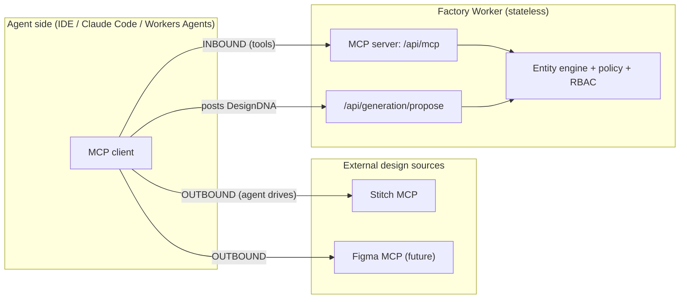
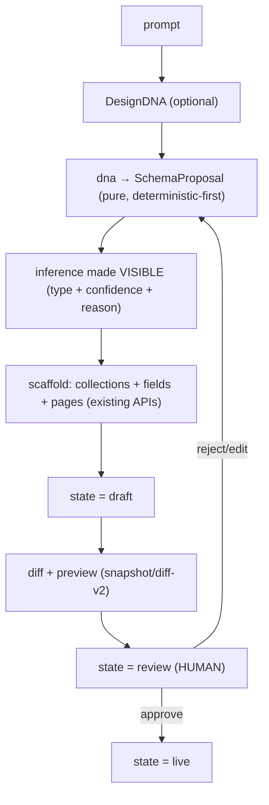

# Governed Generative Factory — Design

> **Date:** 2026-09-25 · **Status:** v2 — P0–P4 SHIPPED (see §14 Revision) · **Scope:** factory core, not a domain module

## ၀။ TL;DR (မြန်မာ)

> **ပန်းတိုင်:** prompt (+ optional **Design DNA**) → **governed**, audited, reversible application
> (collections · fields · pages) ကို **human အတည်ပြုပြီးမှ** live တင်တာ။
>
> **အဓိက ဆုံးဖြတ်ချက် ၄ ခု:**
>
> 1. **အသစ် မဆောက်နဲ့ — ရှိပြီးသား ချိတ်။** repo မှာ seam တိုင်းအတွက် artifact ရှိပြီးသား (ဇယား §8)။
> 2. **MCP ကို boundary မှာ port/adapter** ထား — **inbound** (agent → ငါတို့ = MCP server) နဲ့
>    **outbound** (agent → Stitch = agent-side မှာ; Worker မှာ **မထား**၊ stdio မ run နိုင်လို့)။
> 3. **Human-in-the-loop = workflow STATE** (prompt မဟုတ်) — `draft → review → live`။
> 4. **DSL = codec တစ်ခုတည်း** (SSOT) — seam တိုင်းမှာ ပြန်သုံး၊ DSL ၄ မျိုး မဆောက်။
>
> **အခက်ဆုံး နေရာ:** `DesignDNA → schema` inference။ **deterministic rules-first** + constrained LLM
> fallback + **inference ကို မြင်သာအောင် ပြ** (human က review မှာ ပြင်)။

---

## 1. Goal & Non-Goals

### Goal

One pipeline, four stages (the user's original framing), each stage bound to an existing artifact:

```
Design DNA → Schema Mapping → Scaffold & Injection → Human Vibe Check → live
```

Plus two capabilities the platform must have:

- **INBOUND** — the engine is drivable by an AI agent (and by a human) over **MCP**, least-privilege.
- **OUTBOUND** — the engine accepts a **Design DNA** from a design source (Stitch today, anything tomorrow),
  **without the core knowing the vendor**.

### Non-Goals (zero waste — explicitly OUT)

| Out of scope                                 | Why                                                                                     |
| -------------------------------------------- | --------------------------------------------------------------------------------------- |
| A second field-type catalog                  | `packages/utils/src/field-types.ts` is the SSOT (41 types). Inference maps **into** it. |
| A second block/component registry            | `BLOCK_REGISTRY` (ui-views) + `WIDGET_REGISTRY` (design-system) exist.                  |
| Code generation / a "JIT compiler"           | `new Function`/`eval` are banned on workerd. We emit **metadata**, never code.          |
| Running Stitch MCP `stdio` inside the Worker | Impossible on workerd. The **agent** is the MCP client (§3.2).                          |
| A new UI surface for AI                      | `/api/ai/*` + the Studio canvas already exist and stay.                                 |
| Media/video/social/SEO features              | Base44 scope, not factory scope.                                                        |
| A parallel proposal store                    | Proposal state lives in D1, alongside everything else (§4.5).                           |

---

## 2. Decisions (ADR style)

| #      | Decision                                                                                                                                                 | Rationale (WHY)                                                                                                                     |
| ------ | -------------------------------------------------------------------------------------------------------------------------------------------------------- | ----------------------------------------------------------------------------------------------------------------------------------- |
| **D1** | **Reuse, don't rebuild.** Every stage binds to an existing artifact (§8).                                                                                | SSOT. A parallel registry/catalog is the drift the repo already fought.                                                             |
| **D2** | **MCP is a port/adapter at the boundary.** Inbound = we serve MCP. Outbound = the agent calls Stitch and posts DNA to us.                                | Tool names/transports change; the core must not. `stdio` cannot run in a Worker → the agent is the natural MCP client.              |
| **D3** | **Human-in-the-loop is a state**, not a prompt: `draft → review → live`.                                                                                 | A prompt is non-deterministic and un-auditable. The repo already has the state atoms (IDP workflow, `If-Match` 409, `X-Write-Ack`). |
| **D4** | **ONE codec across all seams** (`packages/types/src/dsl/`).                                                                                              | "DSL everywhere" ≠ 4 DSLs. Precedent: `meta-codec.ts` (columnar, ~39% smaller, shared).                                             |
| **D5** | **Deterministic-first inference**; LLM only for the ambiguous residue, constrained to the 41-field catalog; every inference is **visible + reviewable**. | Same input ⇒ same proposal (determinism). Visibility is what makes the human gate meaningful.                                       |
| **D6** | **Deny-by-default** for design sources and generation.                                                                                                   | Matches every existing policy (`offline_reads`, `writes.mode`, `integrity`). New surfaces start OFF.                                |
| **D7** | **Human gate default = policy-based, defaulting to always-review.**                                                                                      | Answers the open question from brainstorming; a low-risk quiet path can be enabled per-tenant later, never by default.              |

---

## 3. Architecture

### 3.1 Two sides of MCP



**WHY this shape:** the Worker never speaks `stdio`. The agent (which can) pulls DNA from Stitch and
POSTs it to us; the Worker validates/normalizes it (§4.2) and serves its own tools back to the agent.
Both directions are least-privilege and vendor-agnostic.

### 3.2 Pipeline (the four stages, bound to artifacts)



### 3.3 Components (new vs reused)

| Component                                   | Kind                 | Home                                                |
| ------------------------------------------- | -------------------- | --------------------------------------------------- |
| `dsl/` codec + tokens + ops                 | **new**              | `packages/types/src/dsl/`                           |
| `DesignDNA` validator/normalizer            | **new**              | `apps/api/src/lib/services/design-dna.service.ts`   |
| `fieldInference()` (rules-first)            | **new**              | `packages/core/src/inference/field-inference.ts`    |
| `SchemaProposal` builder (`dna → proposal`) | **new**              | `apps/api/src/lib/services/proposal.service.ts`     |
| Inbound MCP server                          | **new**              | `apps/api/src/routes/mcp.ts`                        |
| Generation routes                           | **new**              | `apps/api/src/routes/generation.ts`                 |
| Policy: `generation` / `designSource`       | **extend**           | `packages/core/src/policy/policy-resolver.ts`       |
| AI provider calls                           | **reuse + refactor** | `apps/api/src/lib/services/ai.service.ts`           |
| Scaffolding (collections/fields/pages)      | **reuse**            | `SchemaService`, `ItemMutationService`, page routes |
| Diff / review                               | **reuse**            | `/api/snapshot/diff-v2`, `reviewSchemaChange`       |
| Concurrency / ack                           | **reuse**            | `ifMatchGuard`, `write-ack.ts`                      |
| Approval states                             | **reuse**            | IDP workflow (`draft→review→promoted→live`)         |

---

## 4. Contracts

> All types live in `packages/types/src/dsl/` so the Worker, Studio and SDK share ONE definition.

### 4.1 Field types — **reference the SSOT, never duplicate**

```ts
// SSOT: packages/utils/src/field-types.ts  →  FIELD_TYPE_NAMES: readonly string[] (41)
// Derived union: packages/types/src/entity.ts  →  FieldType
import { VALID_FIELD_TYPES } from '@mmbix/utils/field-types';
```

Every inferred field type **MUST** be a member of `VALID_FIELD_TYPES`. An inference that cannot land on a
member is dropped and surfaced as a warning — it never invents a type.

### 4.2 `DesignDNA` — the design source's _only_ payload

```ts
export interface DesignDNA {
	/** Provenance — lineage: which source, project, screen. */
	source: { provider: 'stitch' | 'figma' | 'manual'; projectId?: string; screenId?: string };
	tokens: {
		palette?: Record<string, string>; // semantic → value  (maps to design-tokens SSOT)
		fonts?: { heading?: string; body?: string };
		spacing?: string[]; // scale, e.g. ['4px','8px',...]
	};
	/** Structure, already reduced to metadata — NEVER raw HTML/CSS. */
	screens: Array<{
		id: string;
		anatomy: string; // the "Anatomy" layer of Stitch's 3-layer prompt
		components: Array<{
			kind: string; // e.g. 'table' | 'form' | 'stat-card' | 'header'
			label?: string;
			/** Observed hints used for inference — text only, never markup. */
			hints?: Array<{ label: string; sampleFormat?: 'currency' | 'date' | 'phone' | 'email' | 'text' }>;
		}>;
	}>;
}
```

**Poka-yoke:** the shape has **no field that can carry markup**. Stitch's HTML/CSS output cannot enter the
factory by construction — only tokens, labels and format hints.

### 4.3 `SchemaProposal` — deterministic output of the mapping stage

```ts
export interface FieldProposal {
	name: string; // sanitized identifier (sanitizeIdentifier)
	type: FieldType; // ∈ VALID_FIELD_TYPES
	required: boolean;
	/** Visible inference — the human gate reviews THIS, not the raw design. */
	inference: {
		confidence: 0 | 1 | 2; // 0 heuristic, 1 rules-high, 2 declared
		reason: string; // "label 'Amount' + currency glyph"
		source: 'rule' | 'declared' | 'llm';
	};
}

export interface SchemaProposal {
	collection: { slug: string; name: string; fields: FieldProposal[] };
	warnings: Array<{ code: string; message: string }>;
	dna?: Pick<DesignDNA, 'source'>; // lineage, copied onto the created collection
}
```

### 4.4 `PatchOp` — structural edits (token-efficient, streaming-safe)

```ts
export type PatchOp =
	| { id: string; op: 'ADD'; parent: string | null; index?: number; node: BlockNode }
	| { id: string; op: 'MOVE'; node: string; parent: string; index: number }
	| { id: string; op: 'REMOVE'; node: string }
	| { id: string; op: 'UPDATE'; node: string; config: Record<string, unknown> }
	| { id: string; op: 'BIND'; node: string; collection: string; field?: string }
	| { id: string; op: 'SPLIT'; node: string; into: 2 | 3; axis: 'row' | 'column' };

/** Applying ops is a PURE function: (tree, ops) → tree.  O(ops).  Idempotent by `id`. */
```

### 4.5 Policy additions (deny-by-default)

Extend `DEFAULT_POLICY` (`packages/core/src/policy/policy-resolver.ts`):

```ts
generation: {
  enabled: false,                 // OFF: no AI write path until an operator turns it on
  requireReview: true,            // human gate; `false` = opt-in auto-promote (higher tier)
  maxFieldsPerProposal: 40,       // bounded (Big-O / DoS)
  allowLlmFallback: true,         // constrained to VALID_FIELD_TYPES
},
designSource: {
  provider: 'none',               // 'none' | 'stitch' | 'figma' | 'manual'
  allowedHosts: [] as string[],   // outbound allowlist (agent-side reference)
},
```

### 4.6 Inbound MCP tools (least-privilege, read-first)

| Tool                                       | Class        | Gate                                         |
| ------------------------------------------ | ------------ | -------------------------------------------- |
| `list_collections` / `describe_collection` | read         | collection read permission                   |
| `propose_schema`                           | **no write** | `generation.enabled`                         |
| `create_collection` / `add_field`          | write        | admin + `generation.enabled`                 |
| `propose_patch`                            | **no write** | `generation.enabled`                         |
| `apply_patch`                              | write        | admin + `generation.requireReview` satisfied |
| `submit_for_review` / `promote`            | state        | workflow permission (IDP)                    |

An MCP key is an API key with a **scope**. New keys start **read-only** (PoLP).

---

## 5. The codec — one format, every seam

**Grammar (v1, lossless):** columnar + positional, modelled on the proven `meta-codec.ts`. The encoder is
**generic over a column schema** — each payload (DNA, proposal, block tree) declares its own column order,
so one encoder serves every seam.

```
WIRE   := HEADER "\n" ROWS
HEADER := column ("\t" column)*          # payload-specific column order, PINNED (deterministic)
row    := cell ("\t" cell)*              # cells positional; absent trailing cells may be elided
# e.g. proposal columns = path, type, name, flags   (flags = compact bits, "r!" = required+unique)
```

**Seams that use it (all of them):**

| Seam               | Payload           | Reuses                       |
| ------------------ | ----------------- | ---------------------------- |
| Design DNA         | tokens + screens  | design-tokens SSOT           |
| Schema proposal    | `FieldProposal[]` | codec rows                   |
| Block tree / patch | ops + tree        | codec rows                   |
| Review diff        | `Δ`               | snapshot/diff-v2             |
| `/api/meta`        | meta              | **existing** `meta-codec.ts` |

**Invariants (pinned by test):**

1. **Lossless** — `decode(encode(x)) === x` for every payload type.
2. **Tolerant** — a plain object (pre-codec shape) decodes as-is (forward/backward compatible), exactly as
   `meta-codec.ts` does.
3. **ONE implementation** — imported by Worker, Studio and SDK. No second encoder. To honour _zero
   legacy_, the existing `apps/studio/src/lib/meta-codec.ts` is **relocated** into `packages/types/src/dsl/`
   and Studio imports it from there — there is never a second encoder.
4. **Deterministic ordering** — keys/rows emitted in a pinned order (no reliance on object order).

---

## 6. Guardrails (non-negotiable)

| Guardrail                      | How                                                                                                                        |
| ------------------------------ | -------------------------------------------------------------------------------------------------------------------------- |
| **No `eval` / `new Function`** | Inference and ops are pure TS. LLM output is JSON/DSL **data**, validated, never executed.                                 |
| **SSOT**                       | Field types ← `packages/utils/src/field-types.ts`. Blocks ← `BLOCK_REGISTRY`. Codec ← `packages/types/src/dsl/`.           |
| **Determinism**                | `dna → proposal` is pure; no `Date.now`/`Math.random`; stable identity; `ORDER BY` where read.                             |
| **Idempotency**                | Ops carry stable `id`s; proposals carry a content hash; re-submitting the same DNA yields the same proposal.               |
| **Statelessness**              | Proposal state in D1 (auditable). No isolate memory.                                                                       |
| **PoLP**                       | MCP keys scoped; new keys read-only; write tools require admin + policy.                                                   |
| **Deny-by-default**            | `generation.enabled = false`, `designSource.provider = 'none'`.                                                            |
| **Big-O**                      | inference **O(fields)**; ops apply **O(ops)**; no unbounded scan. `maxFieldsPerProposal` bounds input.                     |
| **Zero legacy**                | `ai.service.ts` is **refactored into** this pipeline (the `/api/ai/*` route stays as a thin adapter); no duplicate struct. |

---

## 7. Security / STRIDE

| Threat                                                           | Mitigation                                                                                                           |
| ---------------------------------------------------------------- | -------------------------------------------------------------------------------------------------------------------- |
| **Spoofing** — a forged agent calls MCP                          | Bearer API key + HMAC verify (existing `requireAuth`), per-key scope.                                                |
| **Tampering** — Stitch/LLM payload smuggles markup or a bad type | `DesignDNA` shape cannot carry markup; every field type ∈ `VALID_FIELD_TYPES`; identifiers via `sanitizeIdentifier`. |
| **Repudiation** — "who generated this?"                          | `dna.source` stamped on the collection; proposal row in D1 records prompt hash + model + actor.                      |
| **Information disclosure** — prompt leaks tenant schema          | Send only the **target** collection's metadata (codec-compact), never the whole schema.                              |
| **DoS** — huge/expensive proposals                               | `maxFieldsPerProposal`, existing rate-limit tiers, prompt length cap (4 000, already enforced).                      |
| **Elevation** — auto-promote without authority                   | `requireReview = true` default; auto-promote only under an explicit admin policy.                                    |
| **Prompt injection** — design text steers the agent to write     | Generation **proposes**; only the human gate writes. `X-Write-Ack` for confirmable warnings.                         |

---

## 8. Reuse map (SSOT) — the load-bearing table

| Need                 | Existing artifact (do not duplicate)                                                       |
| -------------------- | ------------------------------------------------------------------------------------------ |
| Field types (41)     | `packages/utils/src/field-types.ts` (`FIELD_TYPE_NAMES`, `VALID_FIELD_TYPES`)              |
| Field type union     | `packages/types/src/entity.ts` (`FieldType`)                                               |
| Block vocabulary     | `packages/ui-views/src/block-registry.ts` (`BLOCK_REGISTRY` — pure data)                   |
| Widget vocabulary    | `packages/design-system/src/components/widgets/` (`WIDGET_REGISTRY`)                       |
| Design tokens        | `/api/design-tokens/effective` + `apps/studio/src/lib/tenant-theme.ts` (`tokensToCssVars`) |
| Wire codec precedent | `apps/studio/src/lib/meta-codec.ts` (columnar, lossless, shared)                           |
| Policy engine        | `packages/core/src/policy/policy-resolver.ts` (`DEFAULT_POLICY`)                           |
| Schema/policy writes | `SchemaService`, `ifMatchGuard` (`If-Match` → 409)                                         |
| Diff / review        | `/api/snapshot/diff-v2`, `reviewSchemaChange`                                              |
| Confirmation         | `apps/api/src/lib/write-ack.ts` (`X-Write-Ack`)                                            |
| Approval states      | IDP workflow `draft → review → promoted → live`                                            |
| Audit / lineage      | audit trail + permission lineage + change envelope                                         |
| AI providers         | `apps/api/src/lib/services/ai.service.ts` (workers-ai / openai / mock)                     |
| Module gating        | `ModuleManifest` + `_addons` (`DOMAIN_MODULES` / `PLUGINS`)                                |

---

## 9. Phases & acceptance

| Phase  | Deliverable                                                                   | Acceptance test (repo convention)                                                                                                         |
| ------ | ----------------------------------------------------------------------------- | ----------------------------------------------------------------------------------------------------------------------------------------- |
| **P0** | `dsl/` codec + tokens + `PatchOp`; policy additions                           | `packages/types/src/dsl/__tests__/codec.test.ts` (lossless round-trip, tolerant decode, deterministic order); policy default assertions   |
| **P1** | `DesignDNA` validator; `fieldInference()` rules table; `dna → SchemaProposal` | `apps/api/test/field-inference.spec.ts` (rules hit; unknown → dropped + warning; never a non-member type); proposal is pure/deterministic |
| **P2** | Generation routes + human gate (`propose → draft → diff → review`)            | `apps/api/test/generation-gate.spec.ts` (proposal never writes; review required; `If-Match` 409 on stale promote)                         |
| **P3** | Inbound MCP server, **read-only first**, then gated writes                    | `apps/api/test/mcp-inbound.spec.ts` (scope enforced; deny-by-default; disabled ⇒ 404)                                                     |
| **P4** | Stitch adapter (agent-side, reference) + recorded-fixture tests               | `apps/api/test/design-source-stitch.spec.ts` (fixtures only — no network in CI)                                                           |

Each phase is independently shippable and OFF by default. P1 alone already proves the concept end-to-end
with `designSource.provider = 'manual'`.

---

## 10. Test strategy

- **Pure units first** — codec round-trip, `fieldInference`, `applyOps` (no I/O, fast).
- **Pinning specs** named above; each asserts the _invariant_, not the implementation (the repo's style).
- **Negative controls** where a guard matters (e.g. dropping the review branch must fail the test).
- **No network in CI** — Stitch is exercised through recorded fixtures behind the port.
- Gate: `cd apps/api && npx tsc --noEmit && npx vitest run`, `pnpm --filter @mmbix/studio test`, `pnpm test`.

---

## 11. Telemetry (Information Visibility)

Reuse the Operations surface (`apps/studio/src/components/admin/operations-tab.tsx`):

- generation calls (provider, tokens in/out, latency, success);
- **codec savings** — bytes before/after per seam (proves "ultra saving" empirically);
- inference mix — rule vs llm vs declared, and confidence histogram;
- gate outcomes — proposed / approved / rejected / edited, with reasons.

No row data ever appears in telemetry (existing rule).

---

## 12. Rollout & config

1. Ship P0–P2 with everything OFF. Zero behavioural change to existing deployments.
2. Enable per environment via `infra/env.prod` → `pnpm gen:infra` (never hand-edit wrangler jsonc).
3. If a Durable Object is ever needed for a stateful MCP session, add the binding the same way
   (`infra/env.*` → `gen:infra` → `wrangler types`). **Not needed for this design** — proposal state is D1.
4. Secrets: `wrangler secret put AI_API_KEY` only (never in `vars`).

---

## 13. Risks & open questions

| #   | Risk / question                                                      | Disposition                                                                             |
| --- | -------------------------------------------------------------------- | --------------------------------------------------------------------------------------- |
| R1  | Stitch MCP tool names/transport unverified (see Appendix).           | Design against `DesignDNA` only; the adapter is agent-side and swappable.               |
| R2  | Inference accuracy on ambiguous labels.                              | Low confidence ⇒ mandatory review; never auto-promote on `confidence < 2`.              |
| R3  | Two sources of design tokens (Stitch vs `/design-tokens/effective`). | Stitch DNA is a **proposal**; the operator's design-tokens remain the SSOT on approval. |
| R4  | Auto-promote temptation for speed.                                   | Default `requireReview = true`; auto-promote is an explicit, audited admin policy (D7). |
| Q1  | Should `apply_patch` be one op-batch or per-op?                      | **One batch**, applied in a transaction, `If-Match`-guarded.                            |
| Q2  | Do we need MCP **resources/prompts**, not just tools?                | Defer — tools only in v1 (YAGNI).                                                       |

---

## Appendix — verification log (what was checked, and what was not)

**Verified from sources:**

- **Stitch** (`stitch.withgoogle.com/llms.txt`): Google's AI interface design tool; Gemini Pro; outputs
  high-fidelity designs + editable Figma files + **frontend code (HTML/CSS)**; 3-layer prompt framework
  (Anatomy / Vibe / Content); adjective-driven styling and mood-based palettes; sketch-to-UI.
- **OpenUI** (`openui.com`): "Open Standard for Generative UI" by Thesys (originally W&B); model composes
  components, never runs arbitrary code; terse DSL claimed **67% fewer tokens / 3x faster** vs JSON;
  streaming-first; framework-neutral; Cloudflare listed among backends.
- **Base44** (`base44.com`, `docs.base44.com`): Wix-owned; prompt → full-stack app with managed backend,
  auth, hosting, integrations; **"AI shows previews before it touches anything"**; design tokens set in one
  place; MCP server + SDK/CLI developer platform.
- **Repo:** field-type SSOT at `packages/utils/src/field-types.ts` (41); `DEFAULT_POLICY` in
  `packages/core/src/policy/policy-resolver.ts`; Durable Objects bound (`RATE_LIMIT`, `SCHEDULER`, `LOCK`);
  **no MCP surface exists today**; `ai.service.ts` + `/api/ai/*` exist.

**Not verified (stated honestly):**

- The exact **Stitch MCP tool names** (`extract_design_context`, `generate_screen_from_text`) and its
  transport — the official docs reachable did not enumerate the MCP tool surface. This is precisely why the
  design treats MCP as a **port**, and the adapter as agent-side and disposable.

---

## 14. Revision (v2) — corrections C1–C9 and what shipped

The v1 draft was reviewed against the working tree. Nine corrections were applied; P0–P4 are implemented
and pinned by tests. Deviations from v1 are called out explicitly.

### 14.1 Corrections applied (review → change)

| #      | v1 issue                                                    | v2 resolution                                                                                                                                                                                                |
| ------ | ----------------------------------------------------------- | ------------------------------------------------------------------------------------------------------------------------------------------------------------------------------------------------------------ |
| **C1** | Inference rule table unspecified; no feedback loop.         | `packages/core/src/inference/field-inference.ts` — an ordered, pinned rules table + declared sample-format precedence; SSOT-closed (non-member type ⇒ dropped + warning). Feedback loop deferred (see Open). |
| **C2** | DesignDNA modelled scalar fields only — no relations.       | `DesignDNA.screens[].relations[]` + `inferRelations()` → `RelationProposal[]` on `SchemaProposal`. Relation _application_ is advisory in v1 (see Open).                                                      |
| **C3** | Prompt-only path undefined.                                 | v1 ships `provider: 'manual'` / agent-supplied DNA; `prompt → DNA` is the P4 connector's job (agent-side), not a Worker LLM step.                                                                            |
| **C4** | Generation policy granularity wrong for a _new_ collection. | Kept in `DEFAULT_POLICY` (engine default OFF) **and** per-collection override; all generation routes are admin-only in v1.                                                                                   |
| **C5** | Ship as "factory core" forfeits module gating.              | **Shipped as a gated PLUGIN** (`apps/api/src/plugins/generation/`, `PLUGINS`; MCP likewise). This is the one intentional structural deviation from v1's §3.3.                                                |
| **C6** | LLM I/O contract ambiguous.                                 | v1 is **deterministic-only** (no LLM call) — an avoided call beats any compression; `allow_llm_fallback` is reserved and unused.                                                                             |
| **C7** | `draft→review→live` vs IDP's 5 states.                      | Shipped states: `draft → review → promoted → live`, `rejected` terminal — the same atoms as IDP, not a second machine.                                                                                       |
| **C8** | Bounds partial (fields bounded, patches not).               | `maxFieldsPerProposal` clamped ≤200; `/patch` caps ops at 500; DNA caps screens/components/hints/labels.                                                                                                     |
| **C9** | Streaming/timeouts unaddressed.                             | v1 has no outbound LLM call (C6); D1 state only, CAS on every transition, `apply` idempotent on replay.                                                                                                      |

### 14.2 What shipped (artifact map)

| Artifact                                         | Path                                                                                                                                                                                                  |
| ------------------------------------------------ | ----------------------------------------------------------------------------------------------------------------------------------------------------------------------------------------------------- |
| DSL codec + `PatchOp` + design contracts         | `packages/types/src/dsl/` (`@mmbix/types/dsl`); `meta-codec.ts` relocated here, Studio keeps a re-export shim                                                                                         |
| Deterministic inference                          | `packages/core/src/inference/field-inference.ts`                                                                                                                                                      |
| Policy `generation` / `design_source`            | `packages/core/src/policy/policy-resolver.ts` + `PUT /api/collections/:slug/policies`                                                                                                                 |
| DNA normalizer · proposal builder · gate service | `apps/api/src/plugins/generation/{design-dna,proposal,service}.ts`                                                                                                                                    |
| Generation routes (gated plugin)                 | `apps/api/src/plugins/generation/plugin.ts` → `/api/generation`                                                                                                                                       |
| Read-only inbound MCP                            | `apps/api/src/plugins/mcp/plugin.ts` → `/api/mcp`                                                                                                                                                     |
| Stitch adapter (agent-side reference)            | `apps/api/src/plugins/generation/stitch-adapter.ts` + `apps/api/test/fixtures/stitch-screens.json`                                                                                                    |
| Studio review panel + telemetry                  | `apps/studio/src/components/GenerationPanel.tsx`, `lib/generation.ts`, `admin/operations-tab.tsx`                                                                                                     |
| Tests                                            | `packages/types/src/dsl/__tests__/*`, `packages/core/src/inference/__tests__/*`, `apps/api/test/{generation-gate,mcp-inbound,design-source-stitch}.spec.ts`, `apps/studio/src/lib/generation.spec.ts` |

### 14.3 Status of the deferred items (updated)

- **R1 adapter tool names** — still open. The Stitch fixture adapter maps a _normalized_ recorded shape;
  the exact MCP tool surface needs a live confirmation. Isolated to one agent-side file.
- **Relation application** — **DONE.** A declared relation implying a FK on the collection becomes a
  reviewable `m2o` field (`proposal.ts`), materialized on apply **only when the target collection exists**
  (`service.ts`), so a missing parent skips the FK instead of failing the apply.
- **Learning loop** — **DONE.** `PATCH /api/generation/:id/fields` records a type correction in
  `_generation_corrections`; `GenerationService.create` overlays learned types on every future proposal.
  Studio exposes the edit as a per-field `<select>`.
- **Prompt → DNA** — **DONE (deterministic).** `prompt-dna.ts` parses a prompt with pinned rules — no LLM
  call, no tokens. An LLM fallback remains behind `generation.allow_llm_fallback` (unused in v1).
- **Scoped MCP keys** — **DONE.** `_api_keys.scope` (migration `040_api_keys_scope`); new keys default to
  `read` (PoLP), legacy null → `admin`; `mcpScopeAllows()` refuses a mutating tool to a read key (`-32002`).
  MCP now exposes `propose_schema`, `submit_for_review`, `promote` and `apply_patch` (page write). A schema
  write is available through the control plane's `apply_manifest` (see the separate MCP control-plane design),
  admin + write scope; there is still no one-call ad-hoc schema mutator.

### 14.4 v1 inaccuracies corrected in this revision

- "`/api/ai/*` + the Studio canvas already exist and stay" — the routes exist (blocks only) but the Studio
  has **no** AI caller; the generation panel is net-new UI.
- `packages/types/src/dsl/` did **not** exist; `meta-codec.ts` lived only in `apps/studio`.
- There are **two** field-type files: the names SSOT (`packages/utils/src/field-types.ts`, 41) and the
  defs catalog (`apps/api/src/lib/data/field-types.ts`, labels/`config_schema`). Inference uses the names
  SSOT; UI metadata uses the defs catalog. `docs/concepts/field-types.md` says "39" — stale.
